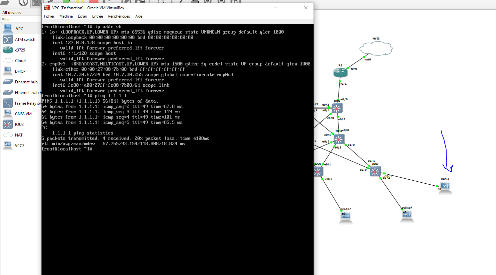

# TP7 INFRA : 3-tier architecture et redondance
## 1. Présentation archi
## 2. Technos utilisées
### E. Preuve et rendu
#### 🌞 show-run sur tous les équipements

Voici les show running-conf, j'enleve ce que je n'ai pas tapé moi meme:


sw1:
```
IOU1#sh running-config
Building configuration...

Current configuration : 1867 bytes
!
! Last configuration change at 21:48:19 UTC Fri Apr 5 2024
!
version 15.2
service timestamps debug datetime msec
service timestamps log datetime msec
no service password-encryption
service compress-config
!
hostname IOU1
!

!
!
interface Port-channel1
 switchport trunk encapsulation dot1q
 switchport mode trunk
!
interface Ethernet0/0
 switchport trunk encapsulation dot1q
 switchport mode trunk
!
interface Ethernet0/1
 switchport trunk encapsulation dot1q
 switchport mode trunk
 channel-group 1 mode on
!
interface Ethernet0/2
 switchport trunk encapsulation dot1q
 switchport mode trunk
 channel-group 1 mode on
!
interface Ethernet0/3
 switchport trunk encapsulation dot1q
 switchport mode trunk
!
interface Ethernet1/0
 switchport trunk encapsulation dot1q
 switchport mode trunk
!


!
end


```
sw2:
```
IOU2#sh running-config
Building configuration...

Current configuration : 1867 bytes
!
! Last configuration change at 21:52:37 UTC Fri Apr 5 2024
!
version 15.2
service timestamps debug datetime msec
service timestamps log datetime msec
no service password-encryption
service compress-config
!
hostname IOU2
!
boot-start-marker
boot-end-marker
!
!
logging discriminator EXCESS severity drops 6 msg-body drops EXCESSCOLL
logging buffered 50000
logging console discriminator EXCESS
!
no aaa new-model
!
 --More--
*Apr  5 22:58:32.086: %CDP-4-DUPLEX_MISMATCH: duplex mismatch discovered on Ethernet0/0 (not half duplex), with R2 FastEthernet0/1 (half duplex)
!
!
!
interface Port-channel1
 switchport trunk encapsulation dot1q
 switchport mode trunk
!
interface Ethernet0/0
 switchport trunk encapsulation dot1q
 switchport mode trunk
!
interface Ethernet0/1
 switchport trunk encapsulation dot1q
 switchport mode trunk
 channel-group 1 mode on
!
interface Ethernet0/2
 switchport trunk encapsulation dot1q
 switchport mode trunk
 channel-group 1 mode on
!
interface Ethernet0/3
 switchport trunk encapsulation dot1q
 switchport mode trunk
!
interface Ethernet1/0
 switchport trunk encapsulation dot1q
 switchport mode trunk
!

```
sw3:
```

IOU3#sh running-config
Building configuration...

Current configuration : 1730 bytes
!
! Last configuration change at 21:37:56 UTC Fri Apr 5 2024
!
version 15.2
service timestamps debug datetime msec
service timestamps log datetime msec
no service password-encryption
service compress-config
!
hostname IOU3
!

!
interface Ethernet0/0
 switchport trunk encapsulation dot1q
 switchport mode trunk
!
interface Ethernet0/1
 switchport trunk encapsulation dot1q
 switchport mode trunk
!
interface Ethernet0/2
 switchport trunk encapsulation dot1q
 switchport mode trunk
!
interface Ethernet0/3
 switchport trunk encapsulation dot1q
 switchport mode trunk
!
interface Ethernet1/0
 switchport trunk encapsulation dot1q
 switchport mode trunk
!

```
sw4:
```
IOU4#sh running-config

!
interface Ethernet0/0
 switchport trunk encapsulation dot1q
 switchport mode trunk
!
interface Ethernet0/1
 switchport trunk encapsulation dot1q
 switchport mode trunk
!
interface Ethernet0/2
 switchport trunk encapsulation dot1q
 switchport mode trunk
!
interface Ethernet0/3
 switchport trunk encapsulation dot1q
 switchport mode trunk
!
interface Ethernet1/0
 switchport trunk encapsulation dot1q
 switchport mode trunk

```
sw5:
```
IOU5#sh running-config
Building configuration...

Current configuration : 1649 bytes
!
! Last configuration change at 21:31:04 UTC Fri Apr 5 2024

!
interface Ethernet0/0
 switchport trunk encapsulation dot1q
 switchport mode trunk
!
interface Ethernet0/1
 switchport trunk encapsulation dot1q
 switchport mode trunk
!
interface Ethernet0/2
 switchport access vlan 10
 switchport mode access
!
interface Ethernet0/3
 switchport access vlan 20
 switchport mode access
!
interface Ethernet1/0

```
sw6:
```

IOU6#sh running-config
Building configuration...

Current configuration : 1598 bytes

interface Ethernet0/0
 switchport trunk encapsulation dot1q
 switchport mode trunk
!
interface Ethernet0/1
 switchport trunk encapsulation dot1q
 switchport mode trunk
!
interface Ethernet0/2
 switchport access vlan 20
 switchport mode access
!

```
sw7:
```
IOU7#sh running-config
Building configuration...

!
interface Ethernet0/0
 switchport trunk encapsulation dot1q
 switchport mode trunk
!
interface Ethernet0/1
 switchport trunk encapsulation dot1q
 switchport mode trunk
!
interface Ethernet0/2
 switchport access vlan 30
 switchport mode access
!

```
r1:
```

R1#sh running-config
Building configuration...

Current configuration : 1655 bytes


!
interface FastEthernet0/0
 ip address dhcp
 ip nat outside
 ip virtual-reassembly
 duplex auto
 speed auto
!
interface FastEthernet0/1
 no ip address
 ip nat inside
 ip virtual-reassembly
 duplex auto
 speed auto
!
interface FastEthernet0/1.10
 encapsulation dot1Q 10
 ip address 10.7.10.252 255.255.255.0
 standby 10 ip 10.7.10.254
 standby 10 priority 150
 standby 10 preempt
!
interface FastEthernet0/1.20
 encapsulation dot1Q 20
 ip address 10.7.20.252 255.255.255.0
 standby 10 ip 10.7.20.254
 standby 10 priority 150
 standby 10 preempt
!
interface FastEthernet0/1.30
 encapsulation dot1Q 30
 ip address 10.7.30.252 255.255.255.0
 standby 10 ip 10.7.30.254
!
interface FastEthernet1/0
 no ip address
 shutdown
 duplex auto
 speed auto
!
interface FastEthernet2/0
 no ip address
 shutdown
 duplex auto
 speed auto
!
ip forward-protocol nd
!
!
no ip http server
no ip http secure-server
ip nat inside source list 1 interface FastEthernet0/0 overload
!
access-list 1 permit any
no cdp log mismatch duplex

!
end

```
r2:
```

R2#sh running-config
Building configuration...

Current configuration : 1610 bytes
!
version 12.4
service timestamps debug datetime msec
service timestamps log datetime msec
no service password-encryption
!
hostname R2
!
boot-start-marker
boot-end-marker
!
!
no aaa new-model
memory-size iomem 5
no ip icmp rate-limit unreachable
ip cef

!
!
interface FastEthernet0/0
 ip address dhcp
 ip nat outside
 ip virtual-reassembly
 duplex auto
 speed auto
!
interface FastEthernet0/1
 no ip address
 ip nat inside
 ip virtual-reassembly
 duplex auto
 speed auto
!
interface FastEthernet0/1.10
 encapsulation dot1Q 10
 ip address 10.7.10.253 255.255.255.0
 standby 10 ip 10.7.10.254
!
interface FastEthernet0/1.20
 encapsulation dot1Q 20
 ip address 10.7.20.253 255.255.255.0
 standby 10 ip 10.7.20.254
!
interface FastEthernet0/1.30
 encapsulation dot1Q 30
 ip address 10.7.30.253 255.255.255.0
 standby 10 ip 10.7.30.254
 standby 10 priority 150
 standby 10 preempt
!
interface FastEthernet1/0
 no ip address
 shutdown
 duplex auto
 speed auto
!
interface FastEthernet2/0
 no ip address
 shutdown
 duplex auto
 speed auto
!
ip forward-protocol nd
!
!
no ip http server
no ip http secure-server
ip nat inside source list 1 interface FastEthernet0/0 overload
!
access-list 1 permit any
no cdp log mismatch duplex
!


```


#### 🌞 depuis pc4.tp7.b1

```
PC1> ping 10.7.30.254
10.7.30.254 icmp_seq=1 timeout
10.7.30.254 icmp_seq=2 timeout
84 bytes from 10.7.30.254 icmp_seq=3 ttl=255 time=14.625 ms
84 bytes from 10.7.30.254 icmp_seq=4 ttl=255 time=17.106 ms
84 bytes from 10.7.30.254 icmp_seq=5 ttl=255 time=16.759 ms

PC1> ping 10.7.30.254
84 bytes from 10.7.30.254 icmp_seq=1 ttl=255 time=20.319 ms
84 bytes from 10.7.30.254 icmp_seq=2 ttl=255 time=19.512 ms
84 bytes from 10.7.30.254 icmp_seq=3 ttl=255 time=18.821 ms
84 bytes from 10.7.30.254 icmp_seq=4 ttl=255 time=17.446 ms
84 bytes from 10.7.30.254 icmp_seq=5 ttl=255 time=18.087 ms

PC1> ping 10.7.10.254
84 bytes from 10.7.10.254 icmp_seq=1 ttl=255 time=10.523 ms
84 bytes from 10.7.10.254 icmp_seq=2 ttl=255 time=8.290 ms
84 bytes from 10.7.10.254 icmp_seq=3 ttl=255 time=9.169 ms
84 bytes from 10.7.10.254 icmp_seq=4 ttl=255 time=7.344 ms
84 bytes from 10.7.10.254 icmp_seq=5 ttl=255 time=5.897 ms

PC1> ping 1.1.1.1
1.1.1.1 icmp_seq=1 timeout
1.1.1.1 icmp_seq=2 timeout
1.1.1.1 icmp_seq=3 timeout
1.1.1.1 icmp_seq=4 timeout
1.1.1.1 icmp_seq=5 timeout

```
toujours le meme probleme qu'au TP6, bug des VPCs, pas d'internet. le nat est bien config et les routeurs peuvent joindre internet. depuis la VM ca marche




## 3. Bonus

### A. ACL
#### 🌞 Le réseau 10.7.30.0/24...


### B. Spanning-tree
#### 🌞 Configuration de...

BPDUGuard


PortFast


### C. Observe then destroy then observe
#### 🌞 Vérifier, à l'aide de commandes dédiées


#### 🌞 Couper le routeur prioritaire


#### 🌞 Couper un switch crucial dans la topo STP


### D. DHCP Helper
#### 🌞 Setup un serveur DHCP

